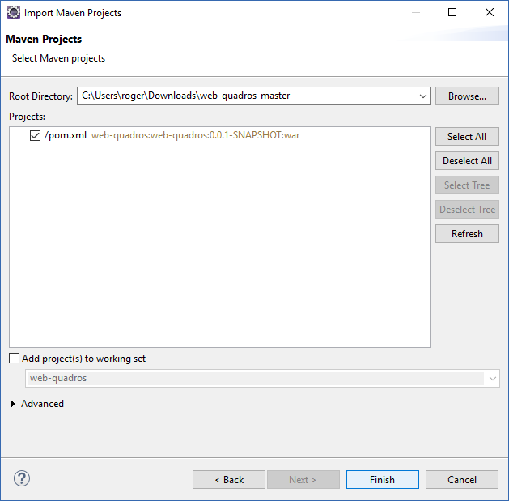

# Web Frames

## Work of matter LP3 - frame virtual store

### Development
***
The application was developed in lenguage Java with the Eclipse IDE, using an architecture MVC with Spring MVC, persistence JDBC and in css e JavaScript, the Bootstrap. 

MySQL as [database](README.md#the-database).

Tomcat as web server.

### Importing the project
***
To import the application to eclipse you have two options:

1° - Download the file, 

2° unpack and move to the workspace folder of Eclipse. 

3° How the application has developed in Maven let's import existing Maven Projects, in the Eclipse IDE, click the menu file -> import, in the window that open choose the git option ->  -> next

4° Click finish.

### The structure of the project is thus:
***
Click on the links to be redirected to the respective layers.

Package | Description
------------|------------
[br.com.quadros.interceptor](src/br/com/quadros/interceptor)| Filter
[br.com.quadros.jdbc](src/br/com/quadros/jdbc)| Data persistence
[br.com.quadros.tarefas](src/br/com/quadros/tarefas)| Controller
[/WebContent/WEB-INF/views](WebContent/WEB-INF/views)| View
[/WebContent/resources](WebContent/resources)| CSS and JavaScript(Bootstrap)

### Initial project setup
***

### The database
***
The database, MySQL, that is in the file [database/Dump20172016.sql](database/Dump20170216.sql).
