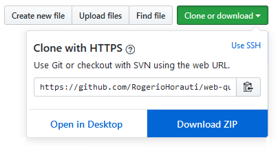
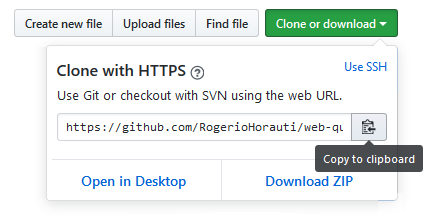

# Web Frames

## Work of matter LP3 - frame virtual store

### Development
***
The application was developed in lenguage Java with the Eclipse IDE, using an architecture MVC with Spring MVC, persistence JDBC and in css e JavaScript, the Bootstrap. 

MySQL as database.

Tomcat as web server.

### Importing the project
***
To import the application to eclipse you have two options:

1° - Download the file, 

unpack, move to the workspace folder of Eclipse. How the application has developed in Maven let's import existing Maven Projects, in the Eclipse IDE, click the menu file -> import, in the window that open choose the git option -> 

2° - Clone the repository - 

### The structure of the project is thus:
***
Package | Description
------------|------------
[br.com.quadros.interceptor](src/br/com/quadros/interceptor)| Filter
[br.com.quadros.jdbc](src/br/com/quadros/jdbc)| Data persistence
[br.com.quadros.tarefas](src/br/com/quadros/tarefas)| Controller
[/WebContent/WEB-INF/views](WebContent/WEB-INF/views)| View
[/WebContent/resources](WebContent/resources)| CSS and JavaScript

### The database
***
The database, MySQL, that is in the file [Dump](database/Dump20170216.sql).
