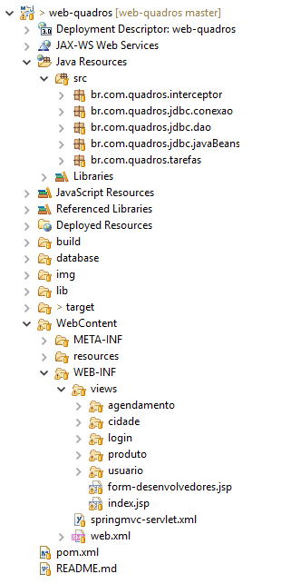

# Web Frames

## Work of matter LP3 - frame virtual store

### Development

The application was developed in lenguage Java with the IDE Eclipse, using an architecture MVC with Spring MVC, persistence JDBC and in css e JavaScript the Bootstrap. The database MySQL, is in the file [Dump](https://github.com/RogerioHorauti/web-quadros/blob/master/database/Dump20170216.sql).

To import the application to eclipse you have two options, clone the repository or download file, how the application has developed in Maven, after downlod, you can import -> Existing Maven Projects.

The server use was the Tomat.

The structure of the project is thus:

